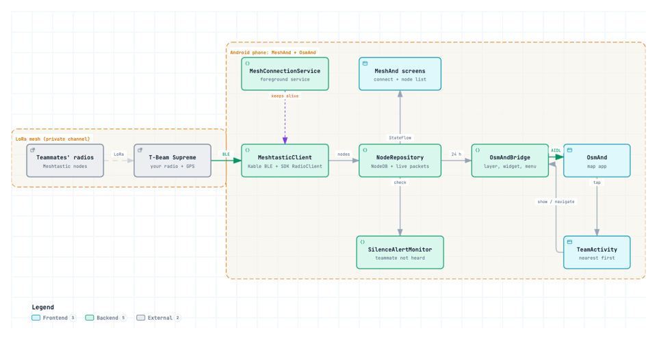

# MeshAnd

**See your Meshtastic team on the OsmAnd map, with no internet and no mobile coverage.**

MeshAnd is a small Android app that connects to your own [Meshtastic](https://meshtastic.org)
radio over Bluetooth, picks up the positions of everyone else in your mesh, and puts them on the
map in [OsmAnd](https://osmand.net), the offline map app you're probably already using to
navigate.

> **This project is 100% vibe coded.** Every line of code, test and document was written by an
> AI (Claude Code), steered by a human who tested it on real radios and a real phone. It works
> for us, but treat it like any hobby project: read the code before trusting it with anything
> important.

## Why it exists

Meshtastic radios are great outdoors. They're cheap, they run for days on a battery, and they
pass GPS positions and messages between each other over long-range LoRa radio, kilometres apart,
where phones have no signal.

But during a hike or a ride you don't want to keep jumping between apps. Your map, offline tiles,
tracks and navigation already live in OsmAnd. MeshAnd brings your friends into that map. Each
teammate is a coloured dot that moves as their radio reports in, and a tap shows how far away
they are and when you last heard from them. You can also ask OsmAnd to navigate you to them.

## What it does

- **Connects straight to your radio** over Bluetooth using the official Meshtastic SDK. The
  official Meshtastic app isn't needed.
- **Puts every teammate on the OsmAnd map** as a coloured point that updates live. Each person
  keeps the same colour everywhere.
- **Adds a team list inside OsmAnd.** A "Meshtastic team" widget on the map and an item in
  OsmAnd's menu list everyone nearest first, with distance and direction ("1.2 km NE"). From
  there, one tap shows them on the map or starts navigation to them.
- **Shows where people have been.** Tap a teammate on the map and choose **Trail** to draw their
  path over the last hour (or 30 minutes to 6 hours) as a line in their colour. It keeps growing
  while it's shown. The track is named after them ("MeshAnd trail - Giorgi"), and a marker shows
  where and when it started. You can reset a trail to start it again from now.
- **Shows how old each position is.** Tapping a teammate on the map, or opening the team list,
  shows when their position was taken, and warns "GPS not updating" when their radio keeps
  re-sending an old one (for example after losing its GPS fix indoors).
- **Tells you if your own GPS is working.** MeshAnd shows when your radio last got a new GPS
  position and how many satellites it sees, and warns you when it gets old. Your own radio is
  hidden on the OsmAnd map unless you switch it on.
- **Remembers trails and pins** on the phone, so they survive restarts. One button clears them.
- **Keeps working in your pocket.** It stays connected with the screen off, reconnects by itself
  when the link drops, and remembers your radio.
- **Warns you when someone goes quiet.** You choose which teammates to watch, and MeshAnd sends a
  notification if one hasn't been heard for 15 minutes to 2 hours.
- **Only shows people heard in the last 24 hours**, so old nodes don't clutter the map.
- **Shares pins.** To show your team a place, tap it in OsmAnd and choose **Share → MeshAnd
  pin**. MeshAnd sends just the coordinates as a short text message, plus a description if you
  tick "Send a description": `meshand: 41.75002,44.77124 Camp`. Shared pins are listed in the
  team list in OsmAnd. Teammates with MeshAnd get a notification and a map pin
  in the sender's colour on their OsmAnd map, with Navigate; everyone else reads it in the Meshtastic app.
- **Otherwise only listens.** Apart from pins you choose to send, MeshAnd never transmits
  anything to the mesh and never changes your radio's settings.
- **Tells you about new versions.** When you open MeshAnd, it asks GitHub whether a newer
  release exists and offers the download. This is the only time MeshAnd uses the internet, and
  you can switch it off at the bottom of the main screen.

## Android only

MeshAnd is an Android app, and there are no plans for iOS. What makes it useful is drawing live
teammates *inside* OsmAnd. That's only possible because OsmAnd for Android lets other apps add
their own map layers. OsmAnd for iOS has no such API, and iOS doesn't let apps plug into each
other this way.

If some of your team use iPhones, they can follow everyone on the map in the official
[Meshtastic iOS app](https://meshtastic.org/docs/software/apple/). Their radios work in the same
mesh, and they still show up for Android users in MeshAnd.

## What you need

- **An Android phone** running Android 7.0 or newer, with **OsmAnd** installed. The free
  version from Google Play is enough.
- **A Meshtastic radio with GPS for every person**, all on the same private channel. Either:
  - **buy a ready-made one.** MeshAnd was built and tested with the **LILYGO T-Beam Supreme**.
    Other Meshtastic radios with Bluetooth and GPS should work too, but haven't been tested yet.
  - **build your own** from an ESP32 or nRF52 board with a LoRa radio and a GPS module, and flash
    it with the [Meshtastic web flasher](https://flasher.meshtastic.org).

## Getting started

1. **Set up the radios** with the official Meshtastic app: region, a private team channel, and
   faster position updates. The defaults only send a position about once an hour.
   [docs/radio-setup.md](docs/radio-setup.md) explains what to change and why.
2. **Install MeshAnd** on your phone. Download the APK from the
   [latest release](https://github.com/mategogiberidze/MeshAnd/releases/latest) and open it on the
   phone. Android will ask you to allow installing apps from that source.
3. **Connect.** Open MeshAnd, grant the Bluetooth permission, scan, and tap your radio. On the
   first connection, type the 6-digit PIN shown on the radio's screen.
4. **Turn on "Show on OsmAnd".** The first time, OsmAnd blocks new apps until you allow them:
   open **OsmAnd → Menu → Plugins** and switch **MeshAnd** on.
5. **Use OsmAnd as usual.** Your team appears on the map. If the "Meshtastic team" widget doesn't
   show, enable it under **OsmAnd → Menu → Configure screen**.

From then on, MeshAnd reconnects to your radio by itself. A small notification shows while it's
connected, with a button to disconnect.

## Good to know

- **Positions are only as fresh as the radios send them.** A private channel and the position
  settings in [radio-setup.md](docs/radio-setup.md) make a huge difference.
- **One phone per radio.** A radio talks to only one app over Bluetooth at a time.
- **Phone makers that kill background apps.** Some aggressively stop apps in the background. If
  the link drops with the screen off, exempt MeshAnd from battery optimisation.
- **Tested setup:** an OUKITEL K10000 Max (Android 7.0), a T-Beam Supreme plus a second Meshtastic node, and the free
  OsmAnd 5.4. Reports from other phones and radios are very welcome.

## Contributing

Bug reports, test results from other phones and radios, and pull requests are all welcome. See
[CONTRIBUTING.md](CONTRIBUTING.md).

- **Developer docs:** building, project structure, logs and the release process are in
  [docs/development.md](docs/development.md).
- **Agent rules:** the rules and facts AI coding agents follow in this repository are in
  [AGENTS.md](AGENTS.md).

## Credits

- [Meshtastic](https://meshtastic.org) and its official
  [Kotlin SDK](https://github.com/meshtastic/meshtastic-sdk), which handles the radio protocol.
- [OsmAnd](https://osmand.net) and its API for other apps, which makes the map integration
  possible.
- The diagram above was made with [Archify](https://github.com/tt-a1i/archify).

## License

MeshAnd is free software under the [GNU General Public License v3.0](LICENSE). It builds on the
GPL-3.0 Meshtastic SDK. You can use, change and share it, as long as anything you distribute
based on it stays under the GPL with its source available.
